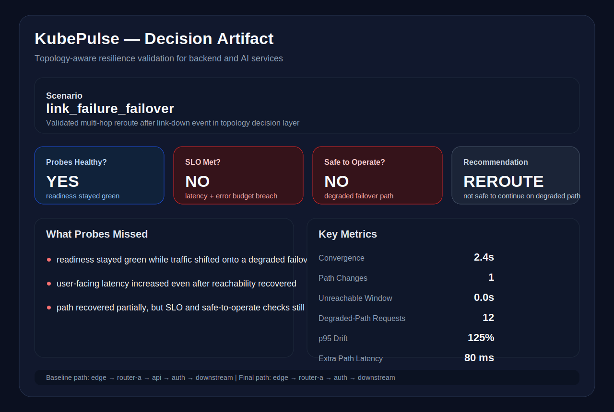

<div align="center">

```
██╗  ██╗██╗   ██╗██████╗ ███████╗██████╗ ██╗   ██╗██╗     ███████╗███████╗
██║ ██╔╝██║   ██║██╔══██╗██╔════╝██╔══██╗██║   ██║██║     ██╔════╝██╔════╝
█████╔╝ ██║   ██║██████╔╝█████╗  ██████╔╝██║   ██║██║     ███████╗█████╗
██╔═██╗ ██║   ██║██╔══██╗██╔══╝  ██╔═══╝ ██║   ██║██║     ╚════██║██╔══╝
██║  ██╗╚██████╔╝██████╔╝███████╗██║     ╚██████╔╝███████╗███████║███████╗
╚═╝  ╚═╝ ╚═════╝ ╚═════╝ ╚══════╝╚═╝      ╚═════╝ ╚══════╝╚══════╝╚══════╝
```
</div>

# KubePulse

**Resilience Validation for Backend and AI Services**

**Kubernetes resilience validation framework measuring recovery, probe integrity, and degraded-path behavior under failure.**

> KubePulse is not a chaos demo. It answers a harder operational question:
> **Did the service truly recover correctly, or did it only appear healthy?**

---

## The Problem

Standard health checks lie.

A service can pass readiness probes, respond to HTTP pings, and show green in your dashboard — while still being unsafe to operate. Downstream DNS is broken. Latency has tripled. Dependency paths are degraded. Your probes don't know.

KubePulse measures whether systems are **actually safe to operate**, not just whether they are up.

---

## What KubePulse Validates

| Signal | What It Tells You |
|---|---|
| **Recovery time** | How long the system took to return to an acceptable state |
| **p50 / p95 latency drift** | Whether latency returned to baseline or remained degraded |
| **Probe integrity** | Whether readiness/health signals matched real availability |
| **DNS / dependency reachability** | Whether downstream services were actually reachable |
| **Error-rate change** | Whether degraded-path behavior increased failure rates |
| **Rollout risk** | Whether it was safe to continue deploying or restoring traffic |

---

## System States

| State | Recovery Time | Latency Drift | DNS Result | Readiness Integrity | Interpretation |
|---|---|---|---|---|---|
| **Healthy** | 0–5s | Minimal | Healthy | Probes aligned with real availability | Safe to operate |
| **Degraded** | Elevated / unstable | Significant drift | Partial or failed | False positives possible | May look healthy while still unsafe |
| **Recovered** | Returned to baseline | Drift normalizing | Path restored | Probes realigned | Safe to resume normal traffic |

---

## Network Lab

KubePulse includes a container-based service network lab for repeatable resilience experiments under controlled degradation.

### Dependency Path

```
edge -> api-service -> auth-service
```

### Scenarios

- `baseline`
- `dns_failure`
- `latency_injection`
- `partial_partition`
- `connection_churn`

### Run in 5 Minutes

> **Prerequisite:** Docker Desktop must be running.

```bash
docker compose -f lab/network-lab/docker-compose.yml up -d --build
bash lab/network-lab/scripts/run_experiment.sh baseline
bash lab/network-lab/scripts/run_experiment.sh dns_failure
```

Verify Docker is available:

```bash
docker info
```

---

## Network Lab Results

### DNS Failure

| | Baseline | Degraded |
|---|---|---|
| Request success | 25 / 25 | **0 / 25** |

**Interpretation:** The dependency path was broken. The service was not safe to treat as recovered. Rollout and traffic restoration should be blocked until DNS resolution is restored.

### API Path Latency Injection

| | Baseline | Degraded |
|---|---|---|
| Request success | 25 / 25 | 23 / 25 |
| p50 latency | 4.888 ms | **1.462 s** |
| p95 latency | 10.120 ms | **2.306 s** |

**Interpretation:** The service path remained partially available, but degraded-hop behavior materially increased latency. The system may appear "up" — operator confidence should be reduced until the degraded path is resolved.

---

## Operational Questions KubePulse Answers

- Did recovery really complete?
- Are readiness probes still trustworthy?
- Is the service degraded even though it looks healthy?
- Is it safe to continue rollout, failover, or traffic restoration?
- Which signals suggest the biggest operational risk?

---

## Dependency-Path Diagnostics

KubePulse infers a lightweight dependency path and emits operator-facing signals:

- Upstream / downstream relationship hints
- Latency and error propagation path
- Likely root-cause service or network segment
- Estimated blast radius across impacted services

---

## Auto-Remediation Recommendations

After each run, KubePulse emits a recommendation bundle:

- Probable source of degradation
- Recommended action: `restart` | `reroute` | `scale` | `isolate`
- Confidence score
- Suggested rollback
- Suggested config-change note

---

## Extending With a New Scenario

1. Add a failure script in `lab/network-lab/scripts/failures/`
2. Add the scenario branch in `lab/network-lab/scripts/run_experiment.sh`
3. Reuse the traffic and measurement scripts to capture:
   - Request success / failure
   - p50 / p95 latency
   - DNS / TCP behavior
   - Recovery timing
4. Document healthy vs degraded vs recovered outcomes
5. Add operator interpretation: safe to operate, still degraded, rollout risk, remediation recommendation

---

## Network-Aware Failure Primitives

KubePulse treats network disruption as first-class validation scenarios:

- Packet loss
- DNS resolution failure
- Service-to-service latency injection
- Node-to-node partition
- Dropped egress / degraded ingress
- MTU mismatch simulation
- Intermittent TCP resets
- Connection churn

For each run, KubePulse captures DNS success rate, TCP connect latency, HTTP success under degraded conditions, cross-zone communication degradation, path recovery time, and latency percentile drift relative to baseline.

---

## Productization Direction

KubePulse is structured as an operator-facing validation tool, not a one-off demo:

- Resilience validation scorecards
- Historical trend storage
- Repeated baseline vs degraded comparisons
- Network-aware failure scenarios
- Operator-facing reports with remediation guidance
- Fast scenario execution and extension workflows

---

## Artifacts

```
docs/scorecards/       # Resilience validation scorecards
docs/reports/          # Example run reports
docs/network-lab/      # Network lab result summaries
docs/screenshots/      # Service looked healthy / service was still degraded
```

---

## Core Idea

> A system can look healthy and still be unsafe to operate.

KubePulse exists to close that gap — surfacing whether systems recovered correctly, whether degraded-path behavior remains dangerous, and whether operators should trust what they are seeing.

## SLO Tracking

KubePulse evaluates YAML-defined SLOs per scenario run across:
- availability target
- p99 latency target
- error-rate target
- SLO window

Example degraded DNS-failure result:
- SLO_MET: false
- availability achieved: 0.0%
- availability target: 99.5%
- latency p99 achieved: 420.0 ms vs 500.0 ms target
- error rate achieved: 8.0% vs 1.0% target
- error budget remaining: 0.0%

## AI Service Reliability and SLO Validation

KubePulse also supports resilience validation for Kubernetes-hosted backend and AI services, including scenario packs for:

- model inference timeout spikes
- vector DB degraded latency
- embedding service unavailable
- tool-router dependency failure
- partial fallback behavior under load

For AI-service scenarios, KubePulse measures:
- availability
- p99 latency
- error rate
- fallback success rate
- degraded-but-serving mode vs full outage

This lets scorecards express conditions like:
- latency SLO passed, error budget exhausted
- retrieval dependency failed, graceful fallback absent
- health probes green but user-facing requests degraded


## Scenario Matrix

KubePulse validates resilience across backend and AI-service failure modes including:

- pod kill
- CPU stress
- network partition
- DNS failure
- inference timeout spike
- vector DB latency degradation
- embedding-service outage
- fallback under load

For each scenario, KubePulse is designed to surface:

- recovery time
- p95/p99 drift
- availability
- fallback success
- error-budget burn
- degraded-serving vs outage

See: `docs/matrices/scenario_matrix.md`

## What Probes Missed

A standout KubePulse feature is exposing cases where health checks looked healthy while service quality was still degraded.

Examples:
- readiness reported healthy but downstream dependencies were still failing
- health probes stayed green while latency and user-visible quality remained degraded
- fallback behavior was serving partial results, but service quality was still unsafe

See: `docs/reports/what_probes_missed.md`

## Scorecard Artifact

KubePulse scorecards are intended to summarize whether a backend or AI service is actually safe to operate after disruption.

See: `docs/scorecards/backend_ai_resilience_scorecard.md`

## Run Comparison

KubePulse can be extended to compare:
- baseline vs disrupted
- release A vs release B

See: `docs/reports/run_comparison.md`

## Operational Showcase

KubePulse is designed to be legible as an operator-facing resilience validation tool, not just a failure-injection demo.

### Scenario Matrix
A matrix view helps compare backend and AI-service failure modes across:
- recovery time
- p95/p99 drift
- availability
- SLO pass/fail
- error-budget burn
- fallback success
- degraded-serving vs outage
- probe false positives

See: `docs/showcase/scenario_matrix.md`

### What Probes Missed
A core KubePulse feature is surfacing cases where readiness looked healthy while user-facing behavior was still degraded.

See: `docs/showcase/what_probes_missed.md`

### Release Compare Mode
KubePulse can be used for:
- baseline vs disrupted comparisons
- previous version vs new version validation
- service A vs service B comparisons

See: `docs/compare/release_compare_mode.md`

### Scorecard Export
KubePulse scorecards summarize whether a service is actually safe to operate after disruption.

See: `docs/scorecards/scorecard_export_showcase.md`

### AI Dependency Chain Case
KubePulse can validate modern backend/AI dependency chains where availability is preserved but user-visible quality still violates SLOs.

See: `docs/showcase/ai_dependency_chain_case.md`

## Operational Showcase

KubePulse is designed to be legible as an operator-facing resilience validation tool, not just a failure-injection demo.

### Scenario Matrix
A matrix view helps compare backend and AI-service failure modes across:
- recovery time
- p95/p99 drift
- availability
- SLO pass/fail
- error-budget burn
- fallback success
- degraded-serving vs outage
- probe false positives

See: `docs/showcase/scenario_matrix.md`

### What Probes Missed
A core KubePulse feature is surfacing cases where readiness looked healthy while user-facing behavior was still degraded.

See: `docs/showcase/what_probes_missed.md`

### Release Compare Mode
KubePulse can be used for:
- baseline vs disrupted comparisons
- previous version vs new version validation
- service A vs service B comparisons

See: `docs/compare/release_compare_mode.md`

### Scorecard Export
KubePulse scorecards summarize whether a service is actually safe to operate after disruption.

See: `docs/scorecards/scorecard_export_showcase.md`

### AI Dependency Chain Case
KubePulse can validate modern backend/AI dependency chains where availability is preserved but user-visible quality still violates SLOs.

See: `docs/showcase/ai_dependency_chain_case.md`

## Network Topology and Convergence Lab

KubePulse also supports topology-aware resilience validation for service dependency paths.

This module models:
- multi-hop topology paths (edge -> router/service hop -> api -> auth -> downstream)
- path maps and route selection
- link up/down events
- failover path selection
- asymmetric path scenarios
- blackhole / unreachable detection
- convergence timing after path failure

Key topology metrics:
- convergence_seconds
- path_changes_total
- unreachable_windows_total
- degraded_path_requests_total

This keeps the project grounded in routing and path-convergence behavior without overclaiming production routing protocol implementation.

## Topology and Decision Layer

KubePulse includes a topology-aware resilience validation layer for degraded network conditions and service dependency paths.

It validates:
- primary path vs failover path
- link-down events
- blackhole / unreachable behavior
- asymmetric path degradation
- link flap / route churn
- convergence timing after failure

Key signals:
- convergence_seconds
- path_changes_total
- unreachable_window_seconds
- degraded_path_requests_total
- path_recovery_status
- safe_to_operate
- what_probes_missed
- recommendation_action

This turns KubePulse from failure testing into operator-facing decision support for whether a backend or AI service is truly safe to operate under degraded network conditions.

## Visual Decision Artifact

A single operator-facing artifact makes KubePulse immediately legible by showing:
- scenario name
- probes healthy?
- SLO met?
- safe to operate?
- what probes missed
- recommendation
- key metrics for convergence, path changes, unreachable window, degraded-path requests, and p95 drift



See also: `docs/scorecards/topology_decision_artifact.md`

## Path / Trace Correlation

For topology and degraded-path scenarios, KubePulse correlates:
- which hop degraded
- where latency increased
- what path changed
- before/after path timeline

This adds dependency-path reasoning and trace-style artifacts so resilience validation explains *where* the service path changed, not just *that* it changed.

See: `docs/showcase/path_trace_correlation.md`

## Canonical Decision Report

KubePulse should be understood through a single operator-facing decision artifact:

- scenario
- probes healthy?
- SLO met?
- safe to operate?
- recommendation
- key metrics

See: `docs/reports/canonical_decision_report.md`

## Compare View

KubePulse supports comparison across:
- baseline
- degraded
- recovered

with emphasis on:
- convergence
- availability
- p95/p99 drift
- error-budget burn
- final decision

See: `docs/compare/baseline_degraded_recovered.md`

## Flagship Scenario Artifacts

The most important scenarios surfaced by KubePulse are:
- link failure failover
- blackhole
- link flap
- asymmetric path

See: `docs/showcase/flagship_scenarios.md`

## What Probes Missed

This is the most important visible concept in KubePulse.

See: `docs/showcase/what_probes_missed.md`

## Compact Metrics

A small table makes the strongest validated outcomes legible at a glance.

See: `docs/showcase/metrics_table.md`
