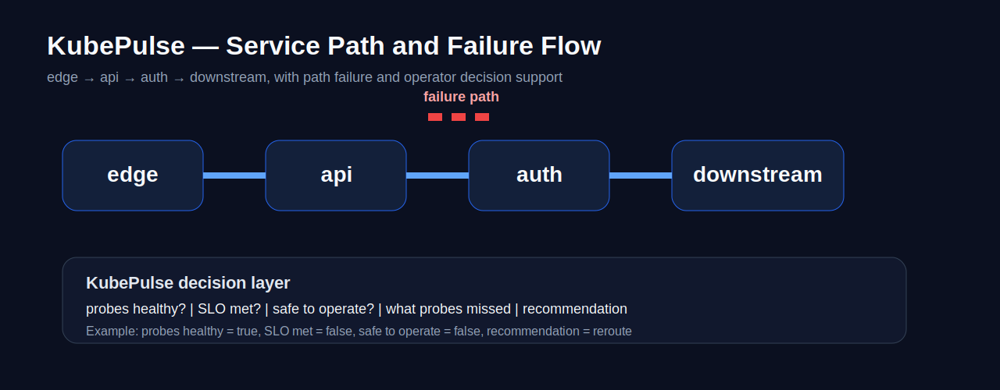

<div align="center">

# KubePulse

**Resilience validation that catches when Kubernetes says healthy but the system is unsafe to operate**

[](https://python.org)
[](https://kubernetes.io)
[](https://terraform.io)
[](https://prometheus.io)

</div>

---

> **Kubernetes tells you whether a pod is alive.**
> **KubePulse tells you whether the system is safe to operate.**

---

## The Problem Standard Probes Don't Solve

A service passes readiness checks. The dashboard is green. Traffic continues.

Meanwhile: a downstream DNS lookup is failing. A dependency cascade has tripled p95 latency. A topology reroute put the service on a degraded path. **Readiness probes stayed green through all of it.**

This is not an edge case. It is a structural gap between container-level health and user-visible health — and most deployment pipelines only measure one.

KubePulse measures both.

---

## Probe False Positive: Demonstrated

### Topology Failover Scenario

A link failure triggers a reroute. Reachability recovers. Kubernetes reports healthy. But the system is now running on a degraded alternate path.

```json
{
  "readiness_false_positive": true,
  "probes_say_healthy": true,
  "safe_to_operate": false,
  "recommendation_action": "reroute",
  "what_probes_missed": "degraded alternate path — higher latency, weaker margins"
}
```

### Multi-Service Cascade Scenario

PostgreSQL latency spike → auth service retry amplification → API layer p99 inflation. Readiness probes stayed green throughout.

```
Dependency chain modeled: edge → api → auth → postgres
```

| Metric | Baseline | Degraded | Delta |
|---|---|---|---|
| p50 latency | 4.9 ms | 240 ms | +4,800% |
| p95 latency | 10.1 ms | 780 ms | **+333%** |
| p99 latency | — | 1,200 ms | **+275%** |
| Error rate | 0% | 8% | +8pp |
| Resilience score | 100 | **46** | −54 |
| Network health | 100 | **75** | −25 |
| Availability gap | 0% | 9% | +9pp |
| Path extra latency | 0 ms | 410 ms | +410 ms |

```json
{
  "readiness_false_positive": true,
  "probes_say_healthy": true,
  "safe_to_operate": false,
  "recommendation_action": "block",
  "slo_violation": true,
  "error_budget_remaining": "0.0%"
}
```

---

## Network Lab Results

Container-based network lab for repeatable degradation experiments.

### DNS Failure

| | Baseline | Degraded |
|---|---|---|
| Request success | 25 / 25 | **0 / 25** |

The dependency path broke entirely. Readiness probes were not informed.

### API Path Latency Injection

| | Baseline | Degraded |
|---|---|---|
| Requests succeeded | 25 / 25 | 23 / 25 |
| p50 latency | 4.888 ms | **1,462 ms** |
| p95 latency | 10.120 ms | **2,306 ms** |

The service appeared "up." The latency made it operationally unsafe.

---

## What KubePulse Validates

| Signal | What it tells you |
|---|---|
| Recovery time | Did the system return to acceptable state, or just stop crashing? |
| p50 / p95 / p99 latency drift | Did latency return to baseline or stay elevated? |
| Probe integrity | Did readiness signals match real availability? |
| DNS / dependency reachability | Were downstream services actually reachable? |
| Error-rate delta | Did degraded-path behavior increase failure rates? |
| SLO pass/fail | Did behavior cross user-facing thresholds? |
| Error budget remaining | How much runway remains before SLO breach? |
| Rollout risk | Should traffic continue, reroute, or stop? |

---

## System States

| State | Recovery | Latency drift | Probes | Interpretation |
|---|---|---|---|---|
| Healthy | 0–5s | Minimal | Aligned | Safe to operate |
| Degraded | Elevated | Significant | **False positive possible** | Looks healthy, unsafe |
| Recovered | Baseline | Normalizing | Realigned | Safe to resume |

---

## Scenarios

| Scenario | Failure type | Key signal |
|---|---|---|
| Readiness false positive | Topology failover + path reroute | `probes_say_healthy=true`, `safe_to_operate=false` |
| Multi-service cascade | DB latency → retry amplification | 333% p95 drift, `recommendation: block` |
| CPU stress | Pod CPU throttling | 8s recovery, resilience score 86/100 |
| DNS failure | Resolver failure | 0/25 success vs 25/25 baseline |
| API latency injection | Degraded hop | p50 4.9ms → 1,462ms |
| AI service timeout | Model inference spike | Fallback success rate, degraded-serving mode |
| Vector DB degradation | Retrieval latency | p99 drift, availability gap |

---

## AI Service Reliability

KubePulse includes scenario packs for Kubernetes-hosted AI services:

- Model inference timeout spikes
- Vector DB degraded latency
- Embedding service unavailable
- Tool-router dependency failure
- Partial fallback behavior under load

For AI scenarios, scorecards surface: availability, p99 latency, fallback success rate, degraded-but-serving vs full outage. The condition "latency SLO passed but error budget exhausted" is expressible and detectable.

---

## Canonical Decision Artifact

```
┌─────────────────────────────────────────────────────────┐
│  Scenario: multi_service_cascade                        │
│                                                         │
│  Probes healthy?      YES  (misleading)                 │
│  SLO met?             NO                                │
│  Safe to operate?     NO                                │
│  Error budget left?   0.0%                              │
│                                                         │
│  What probes missed:  8% error rate, 333% p95 drift,   │
│                       9% availability gap               │
│                                                         │
│  Recommendation:      BLOCK rollout                     │
└─────────────────────────────────────────────────────────┘
```

---

## Architecture

```
YAML scenario definition
        ↓
KubePulse scenario runner
        ↓
Baseline capture (p50 / p95 / p99 / error rate)
        ↓
Failure injection (CPU stress / pod kill / network partition / latency / DNS)
        ↓
Degraded measurement + SLO evaluation
        ↓
Probe integrity check
        ↓
Resilience score (composite)
        ↓
Decision artifact: continue / reroute / block
        ↓
CI gate (GitHub Actions) — blocks deployment if safe_to_operate=false
```

---

## Infrastructure (Terraform)

```bash
cd terraform/
terraform init
terraform apply
```

Provisions: VPC · public and private subnets · NAT gateway · EKS cluster · managed node group

---

## CI Integration

Every PR runs the full resilience suite. Deployments fail if resilience score drops below threshold or `safe_to_operate=false`.

```yaml
- name: Run KubePulse resilience gate
  run: python kubepulse/run_scenarios.py --gate
```

---

## Extending with a New Scenario

1. Add a failure script in `lab/network-lab/scripts/failures/`
2. Add the scenario branch in `run_experiment.sh`
3. Capture: request success/failure, p50/p95 latency, DNS/TCP behavior, recovery timing
4. Document healthy vs degraded vs recovered outcomes
5. Add operator interpretation: safe to operate, still degraded, rollout risk, recommendation

---

## Artifacts

```
docs/scorecards/          Resilience validation scorecards
docs/reports/             Example run reports and what_probes_missed
docs/network-lab/         Network lab result summaries
docs/showcase/            Scenario matrix, false-green gallery, decision artifacts
docs/compare/             Baseline vs degraded vs recovered comparisons
```

---

## Quickstart (Network Lab)

```bash
# Prerequisite: Docker Desktop running
docker compose -f lab/network-lab/docker-compose.yml up -d --build

# Run baseline
bash lab/network-lab/scripts/run_experiment.sh baseline

# Run DNS failure scenario
bash lab/network-lab/scripts/run_experiment.sh dns_failure

# Run latency injection
bash lab/network-lab/scripts/run_experiment.sh latency_injection
```

---

## Interview Framing

KubePulse started as a resilience validation tool. I pushed it toward a release-safety system after noticing that readiness probes stay green during dependency failures and topology reroutes — exactly the conditions where rollout should stop. The core insight is that container health and user-visible health are different measurements, and most deployment pipelines only check one of them.

---

## Stack

Python · FastAPI · Kubernetes · Prometheus · Docker · Terraform (AWS EKS) · GitHub Actions

---

## Related
- [Faultline](https://github.com/kritibehl/faultline) — exactly-once execution correctness under distributed failure
- [Postmortem Atlas](https://github.com/kritibehl/postmortem-atlas) — real production outages, structured by failure class
- [AutoOps-Insight](https://github.com/kritibehl/AutoOps-Insight) — CI failure intelligence and operator triage
- [DetTrace](https://github.com/kritibehl/dettrace) — deterministic replay for concurrency failures
=======
KubePulse validates resilience across backend and AI-service failure modes including:

- pod kill
- CPU stress
- network partition
- DNS failure
- inference timeout spike
- vector DB latency degradation
- embedding-service outage
- fallback under load

For each scenario, KubePulse is designed to surface:

- recovery time
- p95/p99 drift
- availability
- fallback success
- error-budget burn
- degraded-serving vs outage

See: `docs/matrices/scenario_matrix.md`

## What Probes Missed

This is the signature KubePulse idea:

**Green metrics can be misleading.**

KubePulse is built to catch cases where:
- probes report healthy
- dashboards stay green
- components still appear alive

but:
- dependency paths are broken
- latency is still elevated
- fallback quality is degraded
- the service is not actually safe to operate


A standout KubePulse feature is exposing cases where health checks looked healthy while service quality was still degraded.

Examples:
- readiness reported healthy but downstream dependencies were still failing
- health probes stayed green while latency and user-visible quality remained degraded
- fallback behavior was serving partial results, but service quality was still unsafe

See: `docs/reports/what_probes_missed.md`

## Scorecard Artifact

KubePulse scorecards are intended to summarize whether a backend or AI service is actually safe to operate after disruption.

See: `docs/scorecards/backend_ai_resilience_scorecard.md`

## Run Comparison

KubePulse can be extended to compare:
- baseline vs disrupted
- release A vs release B

See: `docs/reports/run_comparison.md`

## Operational Showcase

KubePulse is designed to be legible as an operator-facing resilience validation tool, not just a failure-injection demo.

### Scenario Matrix
A matrix view helps compare backend and AI-service failure modes across:
- recovery time
- p95/p99 drift
- availability
- SLO pass/fail
- error-budget burn
- fallback success
- degraded-serving vs outage
- probe false positives

See: `docs/showcase/scenario_matrix.md`

### What Probes Missed
A core KubePulse feature is surfacing cases where readiness looked healthy while user-facing behavior was still degraded.

See: `docs/showcase/what_probes_missed.md`

### Release Compare Mode
KubePulse can be used for:
- baseline vs disrupted comparisons
- previous version vs new version validation
- service A vs service B comparisons

See: `docs/compare/release_compare_mode.md`

### Scorecard Export
KubePulse scorecards summarize whether a service is actually safe to operate after disruption.

See: `docs/scorecards/scorecard_export_showcase.md`

### AI Dependency Chain Case
KubePulse can validate modern backend/AI dependency chains where availability is preserved but user-visible quality still violates SLOs.

See: `docs/showcase/ai_dependency_chain_case.md`

## Operational Showcase

KubePulse is designed to be legible as an operator-facing resilience validation tool, not just a failure-injection demo.

### Scenario Matrix
A matrix view helps compare backend and AI-service failure modes across:
- recovery time
- p95/p99 drift
- availability
- SLO pass/fail
- error-budget burn
- fallback success
- degraded-serving vs outage
- probe false positives

See: `docs/showcase/scenario_matrix.md`

### What Probes Missed
A core KubePulse feature is surfacing cases where readiness looked healthy while user-facing behavior was still degraded.

See: `docs/showcase/what_probes_missed.md`

### Release Compare Mode
KubePulse can be used for:
- baseline vs disrupted comparisons
- previous version vs new version validation
- service A vs service B comparisons

See: `docs/compare/release_compare_mode.md`

### Scorecard Export
KubePulse scorecards summarize whether a service is actually safe to operate after disruption.

See: `docs/scorecards/scorecard_export_showcase.md`

### AI Dependency Chain Case
KubePulse can validate modern backend/AI dependency chains where availability is preserved but user-visible quality still violates SLOs.

See: `docs/showcase/ai_dependency_chain_case.md`

## Network Topology and Convergence Lab

KubePulse also supports topology-aware resilience validation for service dependency paths.

This module models:
- multi-hop topology paths (edge -> router/service hop -> api -> auth -> downstream)
- path maps and route selection
- link up/down events
- failover path selection
- asymmetric path scenarios
- blackhole / unreachable detection
- convergence timing after path failure

Key topology metrics:
- convergence_seconds
- path_changes_total
- unreachable_windows_total
- degraded_path_requests_total

This keeps the project grounded in routing and path-convergence behavior without overclaiming production routing protocol implementation.

## Topology and Decision Layer

KubePulse includes a topology-aware resilience validation layer for degraded network conditions and service dependency paths.

It validates:
- primary path vs failover path
- link-down events
- blackhole / unreachable behavior
- asymmetric path degradation
- link flap / route churn
- convergence timing after failure

Key signals:
- convergence_seconds
- path_changes_total
- unreachable_window_seconds
- degraded_path_requests_total
- path_recovery_status
- safe_to_operate
- what_probes_missed
- recommendation_action

This turns KubePulse from failure testing into operator-facing decision support for whether a backend or AI service is truly safe to operate under degraded network conditions.

## Visual Decision Artifact

A single operator-facing artifact makes KubePulse immediately legible by showing:
- scenario name
- probes healthy?
- SLO met?
- safe to operate?
- what probes missed
- recommendation
- key metrics for convergence, path changes, unreachable window, degraded-path requests, and p95 drift


See also: `docs/scorecards/topology_decision_artifact.md`

## Path / Trace Correlation

For topology and degraded-path scenarios, KubePulse correlates:
- which hop degraded
- where latency increased
- what path changed
- before/after path timeline

This adds dependency-path reasoning and trace-style artifacts so resilience validation explains *where* the service path changed, not just *that* it changed.

See: `docs/showcase/path_trace_correlation.md`

## Canonical Decision Report

KubePulse should be understood through a single operator-facing decision artifact:

- scenario
- probes healthy?
- SLO met?
- safe to operate?
- recommendation
- key metrics

See: `docs/reports/canonical_decision_report.md`

## Compare View

KubePulse supports comparison across:
- baseline
- degraded
- recovered

with emphasis on:
- convergence
- availability
- p95/p99 drift
- error-budget burn
- final decision

See: `docs/compare/baseline_degraded_recovered.md`

## Flagship Scenario Artifacts

The most important scenarios surfaced by KubePulse are:
- link failure failover
- blackhole
- link flap
- asymmetric path

See: `docs/showcase/flagship_scenarios.md`

## What Probes Missed

This is the most important visible concept in KubePulse.

See: `docs/showcase/what_probes_missed.md`

## Compact Metrics

A small table makes the strongest validated outcomes legible at a glance.

See: `docs/showcase/metrics_table.md`

## Architecture Diagram

KubePulse evaluates resilience across a simple service dependency chain:

`edge -> api -> auth -> downstream`

The diagram below shows how a failure path maps into an operator-facing decision artifact.



See: `docs/showcase/architecture_diagram.md`

## Green Metrics Can Be Misleading

One of the main goals of KubePulse is to catch cases where health checks remain green but operational recovery is not actually complete.

See:
- `docs/reports/green_metrics_misleading.md`
- `docs/showcase/validation_positioning.md`

## Proof Statement

Resilience validation framework that determines whether systems remain operationally safe under degraded conditions, even when conventional health checks stay green.

## Scenario Spec Model

KubePulse scenarios define:
- fault injected
- expected blast radius
- expected signals
- must-hold invariants
- must-not-happen conditions
- safe-to-operate thresholds
- expected recovery window

## Safe-to-Operate Logic

Every run should answer:
- probes healthy?
- service available?
- SLO met?
- downstream healthy?
- error rate acceptable?
- safe to operate?

## False Green Gallery

See: `docs/showcase/false_green_gallery.md`

## Case Study

See: `docs/case_studies/green_probe_false_safety.md`

## Terraform-backed test environment

KubePulse now includes a root-level `terraform/` directory that provisions a minimal AWS EKS environment with VPC, public/private subnets, and a managed node group.

Why this matters:
- moves the project beyond local-only cluster validation
- adds infrastructure-as-code proof for platform and reliability roles
- makes it easier to run KubePulse against a more production-like Kubernetes target

Infra scaffold:
- `terraform/main.tf`
- `terraform/variables.tf`
- `terraform/outputs.tf`
- `terraform/versions.tf`

This complements KubePulse’s core reliability goal: detecting cases where Kubernetes probes remain healthy while the system is unsafe to operate.

## Release Safety Framing

Resilience validation for systems that look healthy but are operationally unsafe.

Kubernetes can tell you whether a pod responds.  
KubePulse tells you whether the service should still receive traffic.

### Release Gate Decision

Example output:

```json
{
  "safe_to_operate": false,
  "release_decision": "block",
  "reason": "latency spike + probe false positive"
}
cd ~/KubePulse || exit 1
source .venv/bin/activate

pkill -f uvicorn || true
python -m uvicorn app.main:app --host 127.0.0.1 --port 8000

