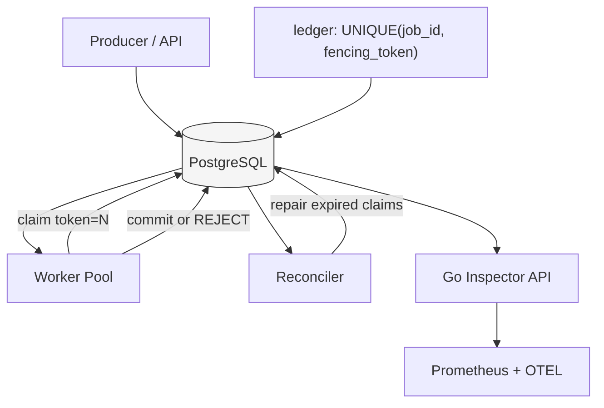

# Faultline

Distributed execution correctness framework that prevents stale-worker corruption using fencing-token validation — **0.0% duplicate commits across 1,500+ injected failure scenarios**.

`Python` · `PostgreSQL` · `Go` · `Prometheus` · `OpenTelemetry` · `Kubernetes`

---

## Problem

Lease-based workers can continue writing after ownership changes.

When a worker crashes, stalls, or partitions from the cluster, its lease expires and another worker takes over. The original worker can recover and attempt to commit — the lease expiry only told the *next* worker to proceed. It did not stop the *previous* worker from writing.

This causes duplicate commits, stale writes, and inconsistent state: double-charges, inventory miscounts, audit records that don't reconcile.

## Goal

Ensure exactly-once commit semantics under worker crashes, lease takeovers, retry storms, and partial failures — enforced at the database boundary, not the application layer.

---

## Architecture


```mermaid
graph TD
    P[Producer / API] --> DB[(PostgreSQL)]
    DB --> W[Worker Pool]
    DB --> R[Reconciler]
    W -->|claim token=N| DB
    W -->|commit or REJECT| DB
    R -->|repair expired claims| DB
    DB --> G[Go Inspector API]
    G --> OBS[Prometheus + OTEL]

    style DB fill:#f5f5f5,stroke:#333
    note1["ledger: UNIQUE(job_id, fencing_token)"] --> DB
```

**How fencing works:**
```
Worker A  claims job  →  token=1
Worker A  stalls (crash / partition)
          lease expires
Worker B  claims job  →  token=2
Worker B  commits         ✓
Worker A  recovers  →  tries to commit  token=1
DB        UNIQUE(job_id, 1) already violated  →  REJECTED  ✗
          0 duplicate commits
```

---

## Verified Results

| Metric | Result |
|---|---|
| Failure scenarios validated | **1,500+** |
| Duplicate commits (Faultline) | **0.0%** |
| Duplicate commits (naive queue, same conditions) | 1.0–2.5% |
| Invariant violations | **0** |
| Worker crash recovery | 1.1s |
| Stale lease takeover recovery | 0.4s |
| Coordination overhead (20% fault rate, measured) | 46.5% of runtime |

---

## Screenshots

| Stale-Worker Timeline | Benchmark Comparison |
|---|---|
|  |  |

| Prometheus Dashboard | Lease Risk Dashboard |
|---|---|
|  |  |


---

## Example Failure

**Scenario:** stale lease takeover

```
1. Worker A claims job_id=abc, fencing_token=7
2. Worker A stalls on network partition for 12s
3. Lease TTL expires (10s)
4. Worker B claims job_id=abc, fencing_token=8
5. Worker B executes and commits → ledger: (abc, 8)  ✓
6. Worker A partition heals, resumes, attempts commit
7. INSERT INTO ledger (job_id, fencing_token) VALUES ('abc', 7)
8. PostgreSQL: UNIQUE violation — (abc, 7) conflicts with existing (abc, 8)
9. Worker A commit: REJECTED
```

**Result:**
```json
{
  "scenario": "stale_lease_takeover",
  "decision": "REJECT",
  "duplicate_commits": 0,
  "stale_writes_prevented": true,
  "invariant_violations": 0
}
```

---

## Engineering Highlights

- **Fencing-token correctness** — monotonically increasing per-lease tokens enforced by `UNIQUE(job_id, fencing_token)` DB constraint, not application logic
- **Replayable failure corpus** — 1,500+ deterministic scenarios: crash, takeover, retry storm, timeout burst, partial write
- **Go inspector API** — `/api/leases`, `/api/workers`, `/api/risk` with OpenAPI spec and lease-risk scoring
- **OpenTelemetry traces** — full distributed trace per job, Jaeger-compatible export
- **Comparison benchmark** — Faultline vs naive lease-only queue under identical fault injection
- **Prometheus observability** — stale rejection count, claim latency histograms, coordination overhead gauge

---

## Validation

```
make test
```

```text
✓  stale worker rejection         — 0 duplicates at 5/10/20% fault rate
✓  duplicate submission           — idempotency enforced
✓  lease expiration during exec   — new worker claims, stale rejected
✓  worker crash mid-commit        — reconciler re-routes, 0 corruption
✓  retry storm (50+ concurrent)   — 0 duplicates under contention
✓  partial write + crash          — reconciler converges state
✓  coordination overhead          — 46.5% measured at 20% fault rate

1,500+ scenarios · 0 invariant violations
```

---

## Why Not Lease-Only / Heartbeats

| Approach | Stale write risk | Correctness model |
|---|---|---|
| Lease-only | Present — advisory expiry | Timing-dependent |
| Heartbeat | Present — eviction gap | Timing-dependent |
| Fencing tokens (Faultline) | **Structurally impossible** | Token ordering enforced at DB |

Heartbeats extend lease duration for healthy workers. They don't change commit semantics. A worker that stops heartbeating gets evicted — but nothing prevents its stale write after recovery. Fencing tokens make that write structurally invalid.

---

## Tradeoffs

- **Polling reconciler:** Recovery latency ~1s. Event-triggered (`LISTEN`/`NOTIFY`) would reduce to ~10ms — chosen polling for simplicity
- **PostgreSQL required:** Fencing depends on transactional uniqueness. Broker-based queues need an external coordination store
- **Coordination overhead is real:** 46.5% of runtime at 20% fault rate — measured and documented, not hidden

---

## What This Does Not Claim

- Not Byzantine-fault-tolerant (fabricated tokens bypass the constraint)
- Benchmark uses simulated fault injection — not production traffic
- External side effects require idempotent job design — fencing prevents double-commit, not double-effect

---

## Future Work

- Event-triggered reconciliation via `LISTEN`/`NOTIFY` — target <10ms recovery
- Failure injection DSL for declarative scenario authoring
- Distributed tracing viewer integrated into inspector dashboard
- Multi-region simulation with cross-datacenter lease semantics

---

## Quick Start

```bash
git clone https://github.com/kritibehl/faultline && cd faultline
docker compose up -d --build && make migrate
make demo    # Faultline vs naive queue benchmark
make test    # 1,500+ failure scenarios
make report  # → reports/latest/benchmark_summary.json
```

---

## Further Reading

- [`docs/case_study.md`](docs/case_study.md) — full design walkthrough
- [`docs/interview_walkthrough.md`](docs/interview_walkthrough.md) — 60s / 3min / 10min explanations

## Repository Map

```
faultline/
├── workers/       worker pool + lease logic
├── reconciler/    crash recovery + state convergence
├── inspector/     Go API — lease risk, worker state
├── benchmarks/    Faultline vs naive queue
├── drills/        1,500+ failure scenarios
├── monitoring/    Prometheus + Grafana
├── docs/          architecture · screenshots · case study
└── reports/       benchmark outputs
```
