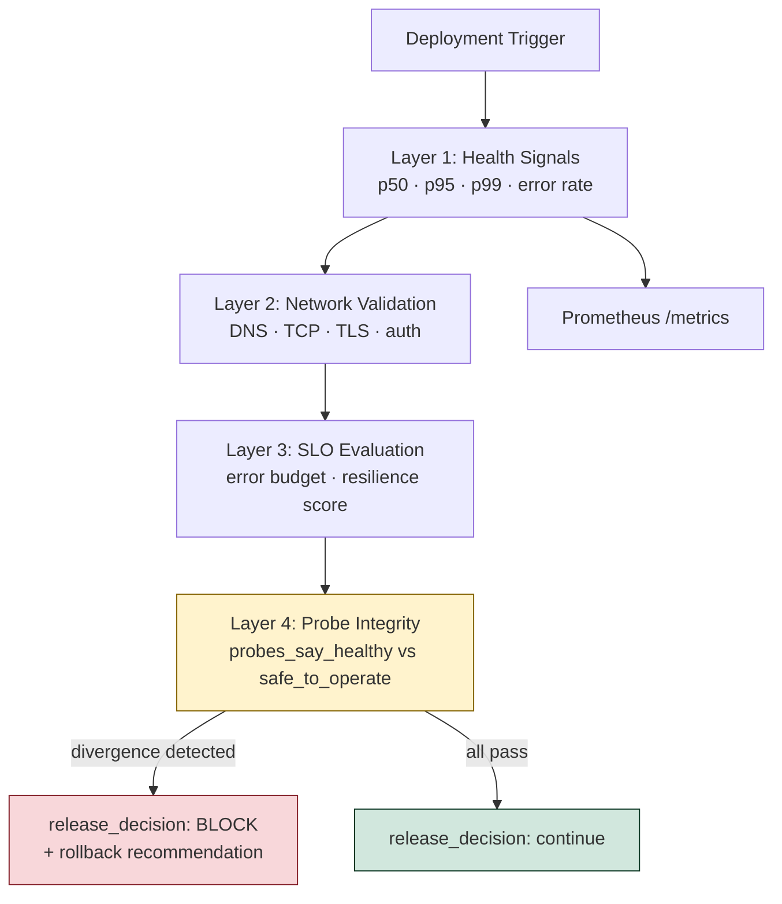

# KubePulse

Kubernetes release-safety platform that detects false-green deployments by comparing container probe state against user-visible health — **5 soak-test scenarios, 0 false-safe decisions, +608% regression blocked**.

`Python` · `Kubernetes` · `FastAPI` · `Prometheus` · `Docker Compose`

---

## Problem

Kubernetes readiness probes check whether a container is alive. They do not check whether the deployment is safe for users.

A service passes every probe while downstream DNS is failing, p95 latency has tripled, and the error budget is at zero. The next deployment wave rolls out. The problem compounds.

## Goal

Measure user-visible health across four validation layers, compare against probe state, and issue an explicit `release_decision` — blocking rollout when probe health and actual health diverge.

---

## Architecture


```mermaid
graph TD
    DT[Deployment Trigger] --> L1[Layer 1: Health Signals\np50 · p95 · p99 · error rate]
    L1 --> L2[Layer 2: Network Validation\nDNS · TCP · TLS · auth]
    L2 --> L3[Layer 3: SLO Evaluation\nerror budget · resilience score]
    L3 --> L4[Layer 4: Probe Integrity\nprobes_say_healthy vs safe_to_operate]
    L4 -->|divergence detected| BLOCK[release_decision: BLOCK\n+ rollback recommendation]
    L4 -->|all pass| CONT[release_decision: continue]
    L1 --> PROM[Prometheus /metrics]

    style L4 fill:#fff3cd,stroke:#856404
    style BLOCK fill:#f8d7da,stroke:#842029
    style CONT fill:#d1e7dd,stroke:#0a3622
```

---

## Verified Results

| Metric | Result |
|---|---|
| Soak-test scenarios validated | **5** |
| False-safe decisions | **0** |
| AMD MI300X burst p95 regression | **+608%** → `BLOCK` |
| Multi-service cascade p95 drift | **+333%** · probes green throughout |
| Error budget at detection | **0.0%** |
| DNS failure detection | 0/25 requests vs 25/25 baseline |

---

## Screenshots

| Quality / Soak-Test Report | Network Diagnostic |
|---|---|
|  |  |

---

## Example Failure

**Scenario:** multi-service cascade — probes green, users degraded

```
Deployment rolls out. All readiness probes: PASS.

Behind the scenes:
  edge-service → api-service → auth-service → postgres
  auth-service connection pool exhausted under load
  Cascade: api-service timeout → edge-service retry storm

KubePulse Layer 1 detects:
  p95 latency: 10.1ms → 780ms  (+7,623%)
  error rate:  0% → 8%

Layer 3 evaluates:
  error_budget_remaining: 0.0%

Layer 4 checks:
  probes_say_healthy: true   ← what Kubernetes sees
  safe_to_operate:    false  ← what users experience
```

```json
{
  "probes_say_healthy": true,
  "safe_to_operate": false,
  "release_decision": "block",
  "error_budget_remaining": "0.0%",
  "what_probes_missed": "333% p95 drift · 8% error rate · 9% availability gap",
  "rollback_recommended": true
}
```

Next deployment wave is blocked. Rollback recommendation issued with full signal context.

---

## Engineering Highlights

- **4-layer release gate** — each layer catches a failure class the others miss; removing any one creates a blind spot
- **Probe integrity check** — explicit `probes_say_healthy` vs `safe_to_operate` comparison; surfaces the false-green gap
- **`what_probes_missed` field** — tells downstream systems exactly what the probe layer didn't see
- **YAML-driven scenarios** — new failure scenario = one YAML file, no backend changes
- **Network diagnostic corpus** — DNS/TCP/TLS validation with structured block reasons
- **AMD MI300X GPU serving gate** — same 4-layer contract applied to AI serving endpoints

---

## Validation

```
make test
```

```text
✓  readiness false positive     — probes=true · safe=false → BLOCK
✓  DNS failure                  — 0/25 requests succeed → BLOCK
✓  API latency injection        — p95 +22,831% → BLOCK
✓  multi-service cascade        — resilience score 100→46 → BLOCK
✓  AMD MI300X burst             — p95 +608% → BLOCK

5 scenarios · 0 false-safe decisions
```

---

## Tradeoffs

- **Simulated injection, not production traffic:** Scenarios model realistic failure classes. Production would combine synthetic injection with real traffic sampling
- **Composite resilience score is a heuristic:** Weights are configurable but not formally derived from an SLO model
- **Terraform / EKS manifests are artifacts:** Proof of infrastructure design — not a managed production cluster

---

## What This Does Not Claim

- Failure injection is simulated — not production traffic replay
- AMD MI300X results are from a controlled burst test — not sustained production load
- Terraform / EKS manifests are deployment artifacts — not a managed production cluster
- Resilience score is a heuristic — not a formal SLO compliance system

---

## Future Work

- Real traffic sampling alongside synthetic injection for hybrid validation
- Deployment wave visualization with per-wave health snapshots
- SLO budget forecasting — project error budget depletion rate from current signal trends
- Auto-remediation integration: block → reroute → rollback decision chain

---

## Quick Start

```bash
git clone https://github.com/kritibehl/KubePulse && cd KubePulse
docker compose -f lab/network-lab/docker-compose.yml up -d --build
make demo    # all 5 scenarios
make test    # 0 false-safe decisions
make report  # → reports/latest/quality_soak_report.json
```

---

## Further Reading

- [`docs/case_study.md`](docs/case_study.md) — full design walkthrough
- [`docs/interview_walkthrough.md`](docs/interview_walkthrough.md) — 60s / 3min explanations

## Repository Map

```
KubePulse/
├── lab/network-lab/  Docker Compose scenarios + scripts
├── scenarios/        YAML scenario definitions
├── gate/             4-layer release-quality gate
├── diagnostics/      DNS · TCP · TLS · auth validation
├── docs/             architecture · screenshots · case study
└── reports/          soak-test + quality gate outputs
```
